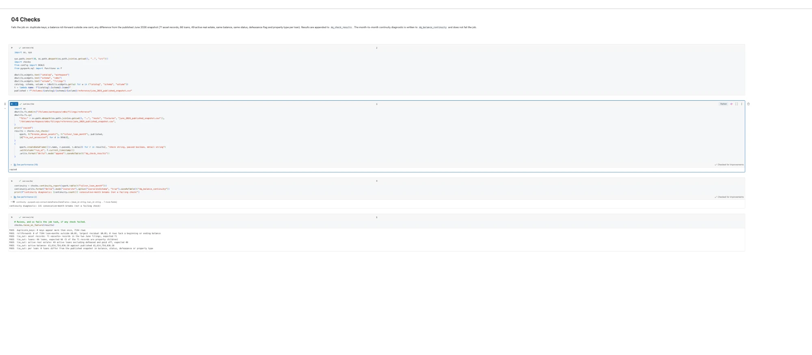

# CMBS Loan Performance History, 2017-2026

A Databricks pipeline that extends
[cre-credit-risk](https://github.com/ZacharyChai/cre-credit-risk) from one monthly
snapshot (June 2026) to the full monthly ABS-EE filing history of the same two CMBS
deals: GS Mortgage Securities Trust 2017-GS6 (CIK 1704459) and 2017-GS7 (CIK 1710765).
cre-credit-risk found that 44.6 percent of the June 2026 pool sat in Elevated or Acute
refinance risk. This project asks when that happened: which loans paid off, which
defeased, and when DSCR slid, using every monthly filing since each deal was issued
rather than one point-in-time snapshot.

The loan-level parsing rules (a real loan's `assetNumber` has no hyphen, the balance
and DSCR fallback chains, the defeasance test) come from `src/parse_absee.py` and
`src/config.py` in cre-credit-risk. This project does not modify that repository.

## What's verified, and what isn't yet

Everything below was first run and checked against **local Spark 3.5.3 with Delta
Lake 3.2.1, ANSI mode on**, against all 225 real cached ABS-EE and ABS-EE/A filings
for both deals. Notebooks `00_setup` through `04_checks` have since been run on an
actual Databricks Free Edition workspace against the same real EDGAR data, and every
number matches the local run exactly: 9,400 bronze records, 7,194 silver loan-months,
and all seven checks passing with the same tie-out figures (see the screenshot below).
`05_gold` and the scheduled job (`jobs/monthly_refresh.json`) are the remaining pieces
not yet confirmed on Databricks.

## Architecture

```
EDGAR (data.sec.gov, www.sec.gov)
  -> 01_fetch    list every ABS-EE / ABS-EE/A filing, cache the asset-data XML
  -> 02_bronze   read <assets> records with Spark, append as raw strings to Delta
  -> 03_silver   type the columns, apply the real-loan rule, MERGE on
                 (deal_id, loan_id, reporting_period_end)
  -> 04_checks   duplicate keys, balance roll-forward, tie-out to the published
                 snapshot -- any failure fails the job
  -> 05_gold     monthly panel by property type: active balance, paid-off and
                 defeased counts, DSCR distribution, occupancy, delinquency
```

`06_time_travel` is a standalone notebook, not part of the chained job; it demonstrates
`VERSION AS OF` on `silver_loan_month`. `jobs/monthly_refresh.json` chains 01 through
05 as one Databricks job with `checks` gating `gold`, on a monthly schedule (see
`jobs/README.md` for why the 28th).

Fetch and bronze are both incremental: fetch never re-downloads a filing that's
already cached, and bronze only reads filings not already in `bronze_absee_assets`, so
a re-run or the monthly schedule loads just the new month.

## Results

All figures below match exactly between the local Spark run and the actual Databricks
Free Edition run against the full 225-filing history.



- **Bronze:** 9,400 `<assets>` records across 225 filings (114 for GS6, 111 for GS7).
- **Silver:** 7,194 loan-months, one row per `(deal_id, loan_id, reporting_period_end)`.
- **Checks, all passing:**
  - `duplicate_keys`: 0 keys appear more than once.
  - `rollforward`: all 7,194 loan-months reconcile (beginning balance minus scheduled
    principal, unscheduled principal, and the month's realized-loss increment, equals
    the ending scheduled balance) to within one cent.
  - `tie_out`: the June 2026 filings reproduce the published cre-credit-risk snapshot
    exactly: 71 `<assets>` records, 66 loans, 49 active real estate loans,
    $1,614,714,036.18 active balance, with zero differences from the published
    snapshot in balance, status, defeasance flag, or property type on any of the 66
    loans.
- **Gold:** 1,568 monthly-panel rows (one per deal, month, and property type present
  that month).

### The reference count correction

cre-credit-risk's README said 71 loans. That's the number of `<assets>` blocks in the
June filings, not the number of loans: GS7 reports two multi-property loans (2 and 5)
as five property-level child records. The real count is 66 loans, and cre-credit-risk's
README has been corrected to say so, in a separate commit there. This project's tie-out
checks both numbers by name (`tie_out: asset records` = 71, `tie_out: loans` = 66) so
the distinction stays visible instead of collapsing into one number.

## Findings from the full history

- **The reference loan-numbering rule missed 42 records in one filing.** GS6's earliest
  filing (2017-05) numbers its multi-property loan's children `4.01`, `4.02`, etc., with
  a dot, not a hyphen. `parse_absee.py`'s hyphen-only rule would count those as loans.
  Silver treats a hyphen or a dot the same way. This affects only that one 2017-05
  filing; June 2026 is unaffected, which is why the tie-out still passes exactly.
- **Realized loss is a running total, not a monthly one.** The filings report
  `realizedLossToTrustAmount` as a cumulative figure that repeats unchanged every month
  after a loan liquidates. The roll-forward check uses the month-over-month change,
  not the raw field, or every post-liquidation month would show a large false residual.
- **131 consecutive-month balance breaks, across 31 loans, mostly in 2018 and 2019.**
  A loan's reported beginning balance for month N sometimes doesn't match its own
  reported ending balance for month N-1 (mostly GS6 loans alternating between their
  original balance and an amortized figure). Each month's own roll-forward still
  reconciles internally, and this is not something a parser choice can fix; it's how
  the servicer reported those months. It's written to `dq_balance_continuity` as a
  diagnostic and does **not** fail the job, because failing on a defect in the source
  data would fail every run going forward, and CLAUDE.md names three specific checks
  that should fail the job, not this one. Anyone reading `gold_monthly_panel` for 2018
  to 2019 should know this exists.
- **GS7 has no filing for the 2017-10 reporting period.** A real gap in the filing
  history, not a download failure; visible directly in the fetch manifest.
- **EDGAR returns intermittent 503s and read timeouts** on individual filing folders,
  separately from the 10-requests-per-second rate limit. `src/edgar.py` backs off up to
  30 seconds and retries; a filing that still fails is written to
  `data/cache/filings_failed.csv` and the run exits non-zero rather than silently
  skipping it.
- **A defeased loan can still carry a real property type code.** The reference rule in
  cre-credit-risk normalizes the property type to `SE` only when the code is already
  blank or `SE`; a loan flagged defeased by `DefeasedStatusCode` while still carrying
  `OF` or another real code keeps that code. `gold.py` and any reader must use
  `is_defeased`, not the property-type label, to exclude defeased loans.

## Delta time travel vs. ALFRED vintages

`VERSION AS OF` on `silver_loan_month` answers what **this table** held right after a
given run of this pipeline: it's a history of this project's own writes, and a bug
fixed today changes every version from here forward, not the ones already written.
An ALFRED vintage in `bridge-pipeline` answers what **the publisher** reported as of a
real-world date, a fact about the source series itself that doesn't change no matter
how many times the pipeline reading it is rerun. See `notebooks/06_time_travel.py` for
a concrete before/after comparison on this table.

## Running it

**Locally** (no Databricks needed, uses local Spark and a temporary Delta warehouse):

```bash
python -m venv .venv && .venv/bin/pip install -r requirements-dev.txt
python src/fetch_history.py         # lists filings, caches the XML: ~225 files, an hour or so
python -m pytest                    # unit tests plus, if the cache exists, the real-data tie-out
python src/run_local.py             # bronze, silver, checks, gold on everything cached
```

**On Databricks** (Free Edition: serverless compute, one 2X-Small SQL warehouse, up to
5 concurrent job tasks, non-commercial use; outbound internet needs LinkedIn
verification):

1. Run `notebooks/00_setup.py` to create the schema and volume.
2. If outbound internet is verified, run `01_fetch` in the workspace. Otherwise run
   `python src/fetch_history.py` and `python src/stage_upload.py` locally and upload
   with the Databricks CLI (`stage_upload.py` prints the exact commands).
3. Run `02_bronze`, `03_silver`, `04_checks`, `05_gold` in order.
4. Deploy `jobs/monthly_refresh.json` to chain all five on a monthly schedule; see
   `jobs/README.md`. It's created paused, run it once manually before unpausing it.

## Repository layout

```
src/
  config.py        deal registry, EDGAR settings (credited to cre-credit-risk)
  edgar.py          list filings, cache XML, retry on EDGAR 503s and timeouts
  fetch_history.py  step 1 CLI: list and cache every filing
  schema.py         explicit bronze schema, generated from all 225 cached filings
  pipeline.py       bronze and silver: read, type, dedupe, MERGE
  checks.py         duplicate keys, roll-forward, tie-out; continuity diagnostic
  gold.py           monthly panel by property type, and the pool-level roll-up
  local_spark.py    local Spark + Delta + XML reader, for tests and src/run_local.py
  run_local.py      runs the whole pipeline locally against the cached filings
  stage_upload.py   stages cached filings for upload when internet isn't verified yet
notebooks/          00 through 06, thin wrappers over src/, run in order on Databricks
jobs/               the monthly job definition and how to deploy it
tests/              pytest: pipeline rules, each check's pass and fail case, gold
                    aggregation, and a real-data tie-out that runs when data/cache exists
```

## Limitations

- Databricks execution itself (serverless compute, Unity Catalog volumes, the
  scheduled job actually running) is unverified until it runs there; see "What's
  verified, and what isn't yet" above.
- The 131 loan-months with a balance-continuity break (see Findings) come from the
  filings as reported; they are surfaced, not corrected.
- Delinquency buckets in `gold_monthly_panel` use the standard CREFC payment status
  codes, which are industry-wide, not something this filing's own schema defines.
  Verify the exact bucket boundaries against a servicer's Investor Reporting Package
  glossary before relying on them for anything beyond this panel.
- Two deals only, both from one issuer's conduit shelf. Nothing here should be read as
  a general claim about CMBS servicer reporting.
- This is a project-level build on Free Edition: serverless compute, small data, no
  cluster tuning, no Databricks certification, no client or production use, and no
  Azure. See `CLAUDE.md`'s claims discipline for what this repo does and doesn't
  support claiming.
